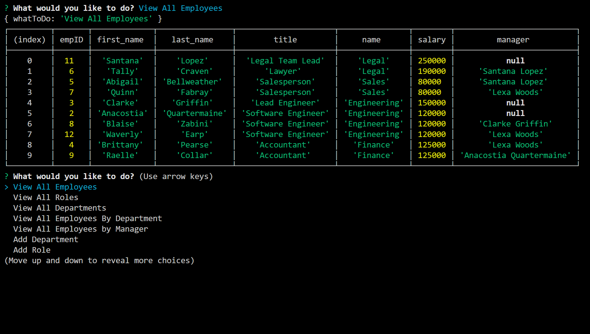

# Employee-Tracker

## Description

For the business owners that need to keep track of their employee, this is a great way to do so! Through a series of prompts, you are able to view all of your employees, roles, and departments; add new employees, departments, and roles; update employee roles, and delete employees!

This was a difficult homework to do. Adding employees and having them actually show up on the database and in the tables took so long, and in the end, it helped me to understand what I was doing, but it took so much time, that I wasn't able to complete all of the requirements. When it came to the delete function, it actually does delete and it shows in the MYSQL Workbench, but it doesn't show it on table in the Terminal. With the update function, I could not get the information to update.

## Credits

Thank you to the other students in this Bootcamp course with me, who sit on the Discord study chat and work together!

## Layout

GitHub Repo Link:

https://github.com/jamjon94/Employee-Tracker

Here's what it looks like!

## License

Copyright (c) [2020] [JamieJones]

Permission is hereby granted, free of charge, to any person obtaining a copy of this software and associated documentation files (the "Software"), to deal in the Software without restriction, including without limitation the rights to use, copy, modify, merge, publish distribute, sublicense, and/or sell copies of the Software, and to permit persons to whom the Software is furnished to do so, subject to the following conditions:

The above copyright notice and this permission notice shall be included in all copies or substantial portions of the Software.

THE SOFTWARE IS PROVIDED "AS IS", WITHOUT WARRANTY OF ANY KIND, EXPRESS OR IMPLIED, INCLUDING BUT NOT LIMITED TO THE WARRANTIES OF MERCHANTABILITY, FITNESS FOR A PARTICULAR PURPOSE AND NONINFRINGEMENT. IN NO EVENT SHALL THE AUTHORS OR COPYRIGHT HOLDERS BE LIABLE FOR ANY CLAIM, DAMAGES OR OTHER LIABILITY, WHETHER IN AN ACTION OF CONTRACT, TORT OR OTHERWISE, ARISING FROM, OUT OF OR IN CONNECTION WITH THE SOFTWARE OR THE USE OR OTHER DEALINGS IN THE SOFTWARE.
